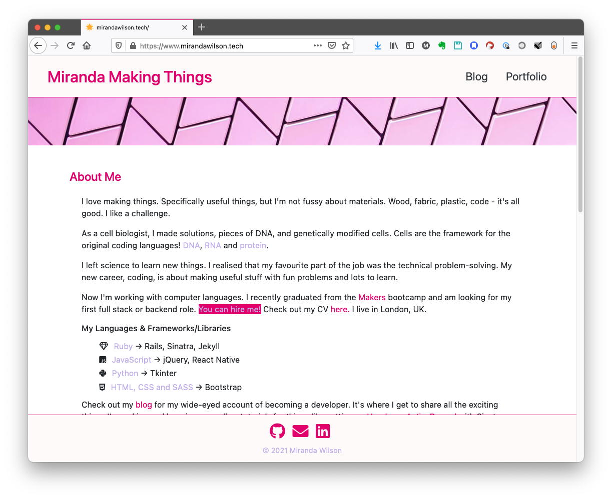
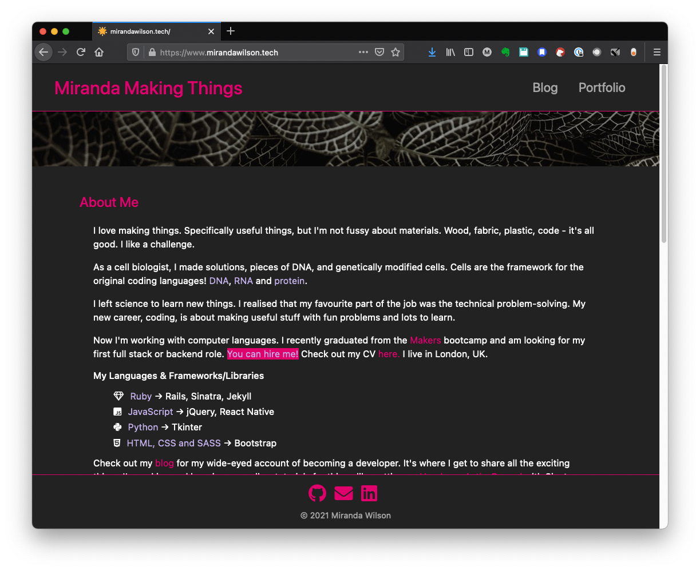

## Miranda Making Things
My personal site, for my blog and portfolio.

### Description
Check out my site [here](https://www.mirandawilson.tech).  

I started my blog when I started at [Makers](https://makers.tech) coding bootcamp, in January 2021. I wanted a place to share my excitement and interest as I learned about programming.  

I used the static site generator Jekyll, as it is designed for blogging: just make a new Markdown file to post. Also, Jekyll sites can be easily hosted on GitHub Pages. Initially I used a pre-made theme, Minimal Mistakes, but wanted to have more control over the design and features. So I created a new site, using Bootstrap for responsiveness.  

The key features I wanted were: about me section; a portfolio page; my blog; and light and dark themes, because I think that's really fun.  

It currently looks like this:  

### Usage
* Clone this repo and navigate into the folder
* Run `bundle` to install dependencies
* Check out the site locally: `jekyll serve`

### Acknowledgements
* [Bootstrap](https://getbootstrap.com/) responsive design
* [Bootswatch](https://bootswatch.com/) - Flatly and Darkly Bootstrap themes
* [Bootstrap Build](https://bootstrap.build). Fantastic site for customising Bootstrap themes
* [Jekyll](https://jekyllrb.com/) static site generator
* [Minimal Mistakes](https://github.com/mmistakes/minimal-mistakes) Jekyll theme. I used this for the previous version of this site, so I kept the overall design and some of the code (e.g. for post excerpts and reading time)
* [Experimenting With Code](https://experimentingwithcode.com)'s incredibly helpful multi-part [tutorial](https://experimentingwithcode.com/creating-a-jekyll-blog-with-bootstrap-4-and-sass-part-1/) on setting up a Jekyll site with Bootstrap
* [Dracula](https://github.com/dracula/pygments) syntax highlighting theme

Images from [Unsplash](https://unsplash.com/):
* Dark banner [image](https://unsplash.com/photos/EQqHRrvDG-Y) by Omid Armin
* Light banner [image](https://unsplash.com/photos/jhw1cRdWkEI) by Annie Spratt

### Known Issues
I didn't include any special rules for old browsers that don't support `prefers-color-scheme`, so it might look bad in that case.
