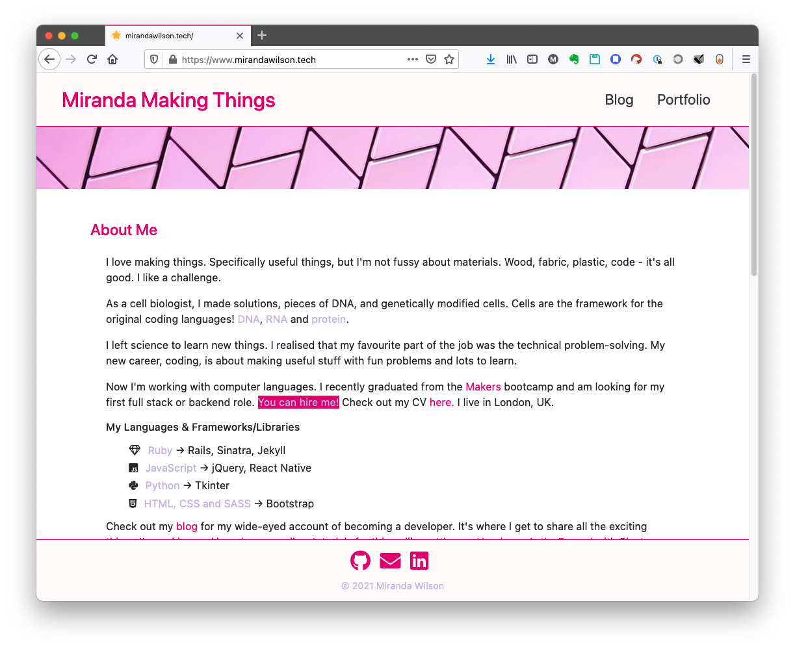
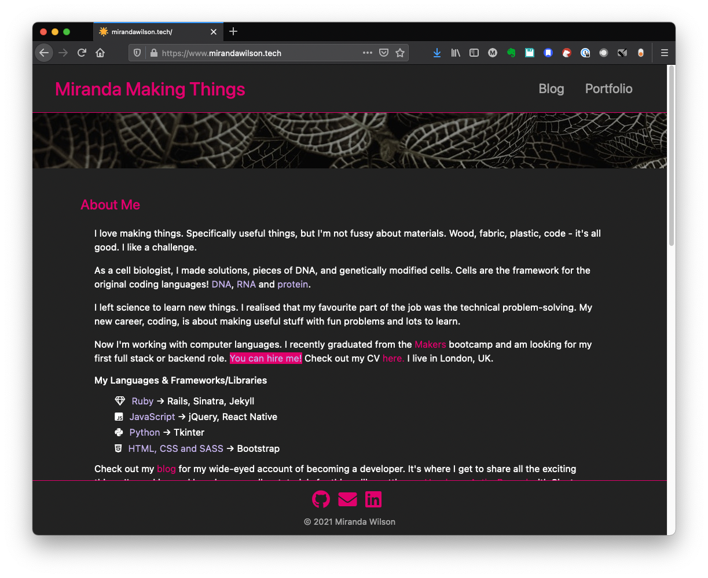

## Miranda Making Things
My personal site, for my blog and portfolio.

### Description
Check out my site [here](https://www.mirandawilson.tech).  

I started my blog when I started at [Makers](https://makers.tech) coding bootcamp, in January 2021. I wanted a place to share my excitement and interest as I learned about programming.  

I used the static site generator Jekyll, as it is designed for blogging: just make a new Markdown file to post. Also, Jekyll sites can be easily hosted on GitHub Pages. Initially I used a pre-made theme, Minimal Mistakes, but wanted to have more control over the design and features. So I created a new site, using Bootstrap for responsiveness.  

The key features I wanted were: about me section; a portfolio page; my blog; and light and dark themes, because I think that's really fun.  

It currently looks like this:  



### Trackers
I've embedded [Snowplow](https://snowplowanalytics.com/)'s JavaScript analytics trackers.  

I'm capturing the standard Page Views and Activity Tracking events on all pages, by including Snowplow's tracker tag and built-in functions in the shared [footer](_includes/footer.html) [script](assets/js/trackers.js).  

For more personalised tracking, I also used link tracking specifically for the [navbar](_includes/header.html) buttons. I added "tracked" to the classes of those links. This would allow me to find out how people navigate around my site. 

Finally, I want to know which of my portfolio projects are the most popular, based on GitHub link clicks. I've added a [script](assets/js/portfolio.js) to the [portfolio HTML](_includes/portfolio.html) to use a custom tracker (`trackSelfDescribingEvent`) based on this [JSON schema](assets/iglu/schemas/test.mwilson/github-link/jsonschema/1-0-0). When users click on the GitHub repo link (which opens a new tab), the event is stored along with the name of the repo.  

The JSON schemas used are referenced from this GitHub repo in Snowplow Micro's [iglu.json](snowplow-micro/iglu.json) config file. I ended up using an older version of the JavaScript Tracker, v2.18.0, as I had a technical problem with v3.1.0 and the `trackSelfDescribingEvent` function. I renamed `sp.js` to `plow.js` to potentially fool adblockers.   


### Usage
* Clone this repo and navigate into the folder
* Run `bundle` to install dependencies
* Check out the site locally: `jekyll serve`

To try out the trackers, make sure Docker is installed first
* Run: 
  ```
  docker run --platform=linux/amd64 --mount type=bind,source={{this folder you just cloned}}/snowplow-micro,destination=/config -p 9090:9090 snowplow/snowplow-micro:1.1.2 --collector-config /config/micro.conf --iglu /config/iglu.json
  ```
* This will start Snowplow Micro inside a container on port 9090
* Access the Micro API: `curl -X GET -H 'Content-Type: application/json' 0.0.0.0:9090/micro/all`
* Explore the site and generate tracking events!  

### Acknowledgements
* [Bootstrap](https://getbootstrap.com/) responsive design
* [Bootswatch](https://bootswatch.com/) - Flatly and Darkly Bootstrap themes
* [Bootstrap Build](https://bootstrap.build). Fantastic site for customising Bootstrap themes
* [Jekyll](https://jekyllrb.com/) static site generator
* [Minimal Mistakes](https://github.com/mmistakes/minimal-mistakes) Jekyll theme. I used this for the previous version of this site, so I kept the overall design and some of the code (e.g. for post excerpts and reading time)
* [Experimenting With Code](https://experimentingwithcode.com)'s incredibly helpful multi-part [tutorial](https://experimentingwithcode.com/creating-a-jekyll-blog-with-bootstrap-4-and-sass-part-1/) on setting up a Jekyll site with Bootstrap
* [Dracula](https://github.com/dracula/pygments) syntax highlighting theme

Images from [Unsplash](https://unsplash.com/):
* Dark banner [image](https://unsplash.com/photos/EQqHRrvDG-Y) by Omid Armin
* Light banner [image](https://unsplash.com/photos/jhw1cRdWkEI) by Annie Spratt

### Known Issues
* There are no tests yet! 😨  
* The portfolio page needs more work - grid layout, pictures, and better information about each project.  
* I didn't include any special rules for old browsers that don't support `prefers-color-scheme`, so it might look bad in that case.
